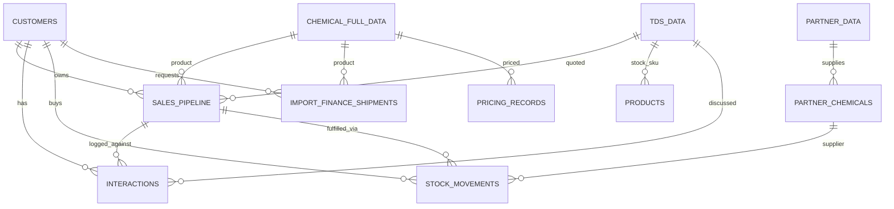

# LeanChem Connect — Application Development Blueprint

**Version:** June 2026  
**Platform:** LeanChem Connect (`blank-slate-dashboard`)  
**Audience:** Leadership, operations, developers, and stakeholders  

---

## 1. Executive summary

**LeanChem Connect** is a unified operations platform for a chemical import and distribution business. It replaces fragmented spreadsheets, Streamlit tools, and disconnected CRM notes with one **AI-augmented workspace** that connects:

| Module | Purpose |
|--------|---------|
| **CRM** | Customer relationships, interactions, AI profiles |
| **PMS** | Product catalog, vendors, TDS, pricing & costing |
| **Sales Pipeline** | CRM deal tracking (Lead ID → Closed/Lost) |
| **Stock** | Multi-location inventory ledger |
| **Trade & Transit** | Import procurement costing (4-stage finance model) |
| **Reports & Analysis** | Cross-module intelligence, forecasts, exports |

**Strategic goal:** Give LeanChem one source of truth from **first customer contact → product selection → deal progression → stock fulfillment → import costing → executive reporting**, with datasets linked by shared customer, product, and deal identifiers.

---

## 2. Vision & what the app aims to achieve

### 2.1 Business problems solved

1. **Siloed data** — Sales, procurement, warehouse, and finance used different files and tools.
2. **No product–customer–deal linkage** — Hard to know which CRM conversation relates to which product deal or stock movement.
3. **Manual import costing** — Landed cost, customs, and margin calculations lived in Excel workbooks.
4. **Weak pipeline visibility** — Deals scattered; no version history or per-product stage tracking.
5. **Stock vs demand mismatch** — Open deals not compared to warehouse availability.
6. **Limited reporting** — No single dashboard crossing CRM activity, pipeline value, catalog health, and stock.

### 2.2 Target outcomes (achieved)

| Outcome | How the app delivers it |
|---------|-------------------------|
| Single login workspace | React SPA + Supabase auth + role-based module access |
| Customer 360° | CRM profiles, interactions, AI chat, linked pipelines |
| Product truth | PMS catalog (`Chemical_Master_Data`), TDS, partner chemicals, pricing junction |
| Deal discipline | `sales_pipeline` with SCD2 versioning, stage reasons, quotations |
| Inventory truth | `stock_movements` ledger across Addis, SEZ Kenya, Nairobi |
| Import economics | Trade & Transit 4-stage calculator persisted to `import_finance_shipments` |
| Executive visibility | Integrated reports, pipeline forecast, Stage 4 Executive Report (BI) |
| AI assistance | Gemini-powered interaction summaries, TDS extraction, cognitive report summaries |

### 2.3 Still evolving

- Full retirement of legacy `customers.sales_stage` in favor of per-deal `sales_pipeline.stage`
- Deeper automation between procurement saves and PMS pricing (partial sync exists)
- Expanded FX / multi-currency executive analytics (Deck C delivered)

---

## 3. System architecture

```
┌──────────────────────────────────────────────────────────────────────────┐
│                     FRONTEND — React 18 + TypeScript + Vite              │
│  Home │ CRM │ PMS │ Sales │ Stock │ Finance (Trade & Transit) │ Reports  │
└───────────────────────────────┬──────────────────────────────────────────┘
                                │ REST (Axios) + Supabase client (import finance)
┌───────────────────────────────▼──────────────────────────────────────────┐
│                     BACKEND — FastAPI (Python) on Vercel                 │
│  /api/v1/crm  /pms  /sales-pipeline  /stock  /reports  /auth  /integrations │
│  Services: crm_service, pms_service, sales_pipeline_service,               │
│            stock_service, integrated_report_service, pipeline_crm_sync,    │
│            ai_service, quotation_service, catalog_sync_service             │
└───────────────────────────────┬──────────────────────────────────────────┘
                                │
┌───────────────────────────────▼──────────────────────────────────────────┐
│                     DATA — Supabase PostgreSQL + Storage + Auth            │
│  CRM tables │ PMS tables │ sales_pipeline │ stock_movements │ import_finance_* │
└──────────────────────────────────────────────────────────────────────────┘
```

**Patterns:**
- Frontend SPA with protected routes and workspace dock navigation
- Backend REST API with Pydantic validation
- Row Level Security (RLS) on Supabase tables
- JWT auth via Supabase; employee gate via `employees` table
- Import finance reads/writes directly from frontend Supabase (parallel to API)

---

## 4. Module blueprint

### 4.1 CRM (Customer Relationship Management)

**Routes:** `/crm`, `/crm/customers`, `/crm/customers/:id`, `/crm/dashboard`, …

**Core tables:**
- `customers` — company master (name, contacts, legacy `sales_stage`, profile text)
- `interactions` — notes, AI responses, file attachments
- `customer_profile_feedback` — profile quality ratings

**Key features delivered:**
- Customer list, detail, manage, add customer
- AI-generated customer profiles (web/LinkedIn research)
- Interaction timeline with optional `tds_id` and `pipeline_id` links
- CRM dashboard metrics
- Telegram integration hooks (archives, backfill)
- Auto-provision employee access for authenticated Supabase users

**Sync to Sales:**
- `pipeline_crm_sync` creates Lead ID deals for new customers
- Interactions auto-link to best-matching product deal
- “Sync all from CRM” on Sales Pipeline page backfills links and stages

---

### 4.2 PMS (Product Management System)

**Routes:** `/pms`, `/pms/chemicals`, `/pms/tds`, `/pms/partners`, `/pms/pricing`, `/pms/products`, `/pms/market`

**Core tables:**
- `Chemical_Master_Data` / `chemical_full_data` — product catalog (UUID `uuid_id` is the cross-system product key)
- `tds_data` — technical data sheets (AI PDF extraction)
- `partner_data`, `partner_chemicals` — suppliers and vendor–product links
- `pricing_records` / `costing_pricing_data` — location-based pricing junction
- `LeanChem_Recommended_Products` — curated product shortlist

**Key features delivered:**
- Chemical master browser with supplier grouping
- TDS upload + Gemini extraction
- Partner & partner-chemical management
- Pricing & costing workspace (locations, landed cost line items)
- LeanChem recommended products (suggestions from master data)
- Catalog sync events to keep pickers fresh across modules

**Links outward:**
- `chemical_type_id` / `uuid_id` on `sales_pipeline`, `interactions`, `import_finance_shipments`
- Stock `products.catalog_uuid_id` → catalog
- Pricing sync from Trade & Transit saves

---

### 4.3 Sales Pipeline

**Routes:** `/sales/pipeline`, `/sales/pipeline/:id`, `/sales/pipeline/:id/edit`

**Core table:** `sales_pipeline` (SCD2 versioning via `parent_pipeline_id`, `version_number`, `is_current_version`)

**Stages:** Lead ID → Discovery → Sample → Validation → Proposal → Confirmation → Closed | Lost

**Key features delivered:**
- Per-customer, per-product deals (multiple deals per company at different stages)
- Stage advancement with reason rules (required on skip/back/close/lost)
- Version history and stage timeline on detail page
- Quotation generation (Excel templates: Betchem, Baracoda)
- CRM sync (bulk and per-interaction)
- Stock integration panel (deal qty vs Addis availability)
- Pricing update banner when PMS prices change
- **Sales costing** — separate import finance saves linked via `/finance/sales-costing/:pipelineId` (`pipeline_domain = sales`)
- Searchable deal table UI (table / by-customer views, pagination)

**Distinct from procurement:**
- Sales deals live in `sales_pipeline` only
- Procurement import costing lives in `import_finance_shipments` with `pipeline_domain = procurement`
- Request refs: `SALES-*` vs `PROC-*`

---

### 4.4 Stock Management

**Routes:** `/stock`, `/stock/general-availability`, `/stock/products/:id`, `/stock/product-label`

**Core tables:**
- `products` — stock SKUs linked to `tds_id` and optional `catalog_uuid_id`
- `stock_movements` — **ledger** (source of truth for balances)

**Locations:** Addis Ababa, SEZ Kenya, Nairobi Partner (location-specific transaction rules)

**Transaction types:** Sales, Purchase, Inter-company transfer, Sample, Damage, Stock Availability, etc.

**Key features delivered:**
- General stock availability grid
- Product detail with movement history
- Inter-company transfer pairing (`paired_movement_id`)
- Customer and pipeline links on movements (`customer_id`, `pipeline_id`)
- Low-stock visibility in integrated reports

---

### 4.5 Trade & Transit (Procurement / Import Finance)

**Routes:**
| Route | Workspace |
|-------|-----------|
| `/finance/import` | Hub (hero + deck cards) |
| `/finance/new-pipeline` | New procurement request |
| `/finance/trade-parameters` | Commercial terms, FX, ports |
| `/finance/product-costing` | 4-stage calculator per product line |
| `/finance/transit-summary` | Accounting breakdown + saved procurement snapshots |
| `/finance/executive-report` | Stage 4 BI dashboard |
| `/finance/sales-costing/:pipelineId` | Sales-linked costing (separate domain) |

**Core tables:**
- `finance_constants` — duty, VAT, WHT, scan fee rates
- `import_finance_products` — finance product registry
- `import_finance_shipments` — **persisted pipeline snapshots** (inputs + Stage 1–4 outputs)

**Four-stage costing model:**

| Stage | What is calculated |
|-------|-------------------|
| **1 — Capital** | Moyale border capital outlay (parallel FX) |
| **2 — Customs** | CIF, duty, scan, social, WHT, VAT |
| **3 — Landed** | Inland transport, net landed cost ETB/kg |
| **4 — Margin** | Target selling price, profit/kg, gross margin %, revenue |

**Key features delivered:**
- Multi-product requests with PMS catalog linking (`chemical_type_id`)
- CRM customer linking (`customer_id`, client name, contact, request date/ref)
- Workbook CSV import with review modal
- Save all product lines → Supabase snapshots
- Pull latest pricing from PMS; sync costing back to pricing junction
- Transit summary with edit/remove (session), paginated saved customers (5/page)
- Executive Report Decks A (products), B (customers), C (currency & FX)
- Auto-refresh executive report on pipeline save event
- Pipeline domain separation (`procurement` vs `sales`)

---

### 4.6 Reports & Analysis

**Routes:** `/reports`, `/reports/crm`, `/reports/analytics`, `/reports/executive`

**Backend:** `integrated_report_service`, `crm_report_service`, `sales_pipeline_service` (forecast/insights)

**Integrated report snapshot includes:**
- **Stock** — total kg, per-location, low SKUs, catalog links, pipeline/customer-linked movements
- **PMS** — catalog count, active pricing, locations, catalog↔stock links
- **Trade & Transit** — shipment count, CRM/catalog links, avg landed cost, avg margin
- **Links** — open deals, deals with catalog product, stock fulfillment checks
- **Fulfillment risks** — open deals exceeding Addis stock
- **Product demand top** — pipeline-weighted demand signals

**CRM reports:**
- Customer coverage, interaction volume, weekly charts
- Pipeline forecast and insights
- PDF export
- Quiet customer lists

**Executive report (Trade & Transit):**
- Cross-filter product/customer decks
- Cost structure, revenue/margin charts
- FX spread, currency ledger, margin by currency
- AI cognitive summaries
- PDF export

---

## 5. How datasets interconnect

### 5.1 The product spine

```
Chemical_Master_Data / chemical_full_data
    uuid_id (chemical_type_id) ─────┬──► sales_pipeline.chemical_type_id
                                    ├──► import_finance_shipments.chemical_type_id
                                    ├──► interactions (via tds → chemical)
                                    ├──► stock products.catalog_uuid_id
                                    └──► PMS pricing_records (catalog link)
```

**Rule:** `chemical_full_data.uuid_id` is the canonical product reference across CRM, Sales, Stock, and Trade & Transit.

### 5.2 The customer spine

```
customers.customer_id ─────┬──► sales_pipeline.customer_id
                           ├──► interactions.customer_id
                           ├──► stock_movements.customer_id
                           └──► import_finance_shipments.customer_id
```

### 5.3 The deal spine (two parallel tracks)

```
SALES TRACK                          PROCUREMENT TRACK
─────────────────                    ───────────────────
sales_pipeline.id                    import_finance_shipments
  │                                    │ pipeline_domain: procurement | sales
  ├── interactions.pipeline_id         │ sales_pipeline_id (optional link)
  ├── stock_movements.pipeline_id      ├── request_ref (PROC-* / SALES-*)
  └── quotations (metadata)            └── chemical_type_id, customer_id
```

### 5.4 CRM ↔ Sales automation

```
New customer → ensure_lead_pipeline_for_product()
Interaction logged → sync_interaction_to_sales_pipeline()
  → resolves best deal by tds_id / chemical_type_id / customer
  → may advance stage based on AI + rules
Bulk sync → sync_all_customer_pipelines()
```

### 5.5 PMS ↔ Trade & Transit

```
Product costing save → import_finance_shipments row
                    → syncTradeTransitLinesToPricing() → pricing_records
Pull latest pricing → pullLatestTransitPricing() from PMS into calculator inputs
```

### 5.6 Stock ↔ Sales fulfillment

```
Open sales_pipeline deal (quantity + unit)
    → integrated_report compares to get_stock_availability_by_catalog()
    → PipelineFulfillmentRisk when deal_qty > addis_available_kg
    → PipelineDetailPage StockIntegrationPanel
```

### 5.7 Entity relationship (simplified)



*(Full ER: `docs/schema_er_diagram.mmd`)*

---

## 6. End-to-end workflows

### Workflow A — New customer to first deal

1. Add customer in CRM (`/crm/customers/new`)
2. System seeds Lead ID pipeline deal(s) via `pipeline_crm_sync`
3. Log interactions on customer detail; AI links to product deal
4. Advance deal on Sales Pipeline with stage reasons
5. At Proposal → generate quotation Excel from pipeline

### Workflow B — Import procurement costing

1. Open Trade & Transit hub → **New procurement pipeline**
2. Enter customer request (CRM pick, PROC-* ref, date, contact)
3. Add product lines from PMS catalog; enter qty and supplier price
4. Calculator runs Stages 1–4 per line
5. **Save all product lines** → `import_finance_shipments` (`pipeline_domain = procurement`)
6. Optional: sync to PMS pricing; view **Transit summary** (paginated saved requests)
7. Executive report auto-updates on save

### Workflow C — Sales deal with import costing

1. Manage deal on `/sales/pipeline/:id`
2. Click **Sales costing** → `/finance/sales-costing/:pipelineId`
3. Save costing snapshots with `pipeline_domain = sales` + `sales_pipeline_id`
4. Separate from procurement transit summary lists

### Workflow D — Stock fulfillment check

1. Open deal in Sales Pipeline detail
2. Stock panel shows Addis availability vs deal quantity
3. Integrated report flags deals exceeding stock
4. Record stock movement linked to `pipeline_id` and `customer_id`

### Workflow E — Management reporting

1. `/reports/crm` — activity, forecast, integrated snapshot
2. `/finance/executive-report` — procurement BI with FX deck
3. Export PDF / CSV for leadership

---

## 7. Deliverables catalog

### 7.1 Platform infrastructure

| Deliverable | Status |
|-------------|--------|
| React + Vite + TypeScript frontend | ✅ |
| FastAPI backend on Vercel | ✅ |
| Supabase PostgreSQL + Auth + Storage | ✅ |
| Employee RBAC + protected routes | ✅ |
| Password change with email OTP | ✅ |
| Workspace dock navigation | ✅ |
| 35+ SQL migrations in `docs/` | ✅ |

### 7.2 CRM

| Deliverable | Status |
|-------------|--------|
| Customer CRUD + manage | ✅ |
| AI profile research | ✅ |
| Interaction timeline + AI chat | ✅ |
| Customer dashboard | ✅ |
| Telegram integration API | ✅ |
| Pipeline link on interactions | ✅ |

### 7.3 PMS

| Deliverable | Status |
|-------------|--------|
| Chemical master data browser | ✅ |
| TDS management + AI PDF extract | ✅ |
| Partners & partner chemicals | ✅ |
| Pricing & costing junction | ✅ |
| LeanChem recommended products | ✅ |
| Landed cost line items | ✅ |

### 7.4 Sales

| Deliverable | Status |
|-------------|--------|
| 8-stage pipeline with versioning | ✅ |
| Per-product deals per customer | ✅ |
| CRM bulk sync | ✅ |
| Quotation Excel generation | ✅ |
| Stock integration on deal detail | ✅ |
| Searchable paginated deal list | ✅ |
| Sales costing workspace (import finance link) | ✅ |

### 7.5 Stock

| Deliverable | Status |
|-------------|--------|
| Multi-location ledger | ✅ |
| General availability view | ✅ |
| Inter-company transfers | ✅ |
| Catalog + pipeline + customer links | ✅ |

### 7.6 Trade & Transit

| Deliverable | Status |
|-------------|--------|
| 4-stage import calculator | ✅ |
| Multi-product requests | ✅ |
| Workbook import | ✅ |
| Supabase snapshot persistence | ✅ |
| Trade parameters workspace | ✅ |
| Transit summary + saved pipelines pagination | ✅ |
| Executive Report (Decks A, B, C) | ✅ |
| Procurement vs sales domain separation | ✅ |
| PMS pricing sync | ✅ |

### 7.7 Reports

| Deliverable | Status |
|-------------|--------|
| CRM reports + PDF | ✅ |
| Pipeline forecast & insights | ✅ |
| Integrated cross-module snapshot | ✅ |
| Analytics dashboard route | ✅ |
| Executive report (finance + `/reports/executive`) | ✅ |

---

## 8. Technology reference

| Layer | Stack |
|-------|-------|
| UI | React 18, TypeScript, Tailwind CSS 4, Lucide icons |
| Build | Vite 5 |
| Routing | React Router 6 |
| API client | Axios |
| Backend | FastAPI, Pydantic v2, Uvicorn |
| Database | Supabase PostgreSQL |
| Auth | Supabase Auth (JWT) + employees table |
| AI | Google Gemini (chat, TDS extract, report summaries) |
| Files | Supabase Storage, XLSX export |
| Deploy | Vercel (frontend + API) |

---

## 9. Security & access

- All business routes behind `ProtectedRoute`
- Module visibility via permissions (`useCanView`, `usePermissions`)
- Supabase RLS on sensitive tables
- Employee must exist in `employees` for app access (with auto-provision path for authenticated users)
- Import finance: authenticated RLS on `import_finance_*` tables

---

## 10. SQL migrations roadmap (key scripts)

| Script | Purpose |
|--------|---------|
| `0001_enums_and_integrity.sql` | Core enums and constraints |
| `0010_pricing_junction.sql` | Pricing records model |
| `0011_stock_crm_pms_links.sql` | Cross-module FK columns |
| `0013b_import_finance_public_tables.sql` | Import finance tables |
| `0014_import_finance_pipeline_columns.sql` | Stage 1–4 snapshot columns |
| `0018–0023` | Client, contact, date, customer, currency on shipments |
| `0025_import_finance_pipeline_domain.sql` | Procurement vs sales domain |

---

## 11. Goals vs achievements summary

| Goal | Achievement |
|------|-------------|
| One platform for CRM + products + sales + stock | ✅ Six workspace decks on home page |
| Link customers to deals and products | ✅ Shared UUIDs + sync services |
| Track deals with audit trail | ✅ SCD2 pipeline versions + stage reasons |
| Import landed cost automation | ✅ 4-stage calculator + DB snapshots |
| Know if stock can fulfill deals | ✅ Integrated fulfillment risks |
| Leadership reporting | ✅ Integrated + Executive BI reports |
| AI to reduce manual work | ✅ Profiles, TDS extract, interaction AI, cognitive summaries |
| Separate sales deals from procurement costing | ✅ `sales_pipeline` vs `import_finance_shipments` + `pipeline_domain` |
| Employee access for team | ✅ Auth + employees RLS + password flow |

---

## 12. Recommended next steps

**Platform status:** All Supabase integrations are complete. Core teams have been consulted and trained. The system is ready to run.

### Foundation complete

| Team | Module | Status |
|------|--------|--------|
| Finance | Trade & Transit (costing, transit summary, executive report) | Trained |
| Sales | CRM (customers, interactions) and Sales Pipeline | Consulted and trained |
| Product managers | PMS (catalog, TDS, pricing) | Consulted and trained |

### Phase 1 — Run and integrate with teams

1. **Operate in production** — use LeanChem Connect as the daily workspace, not a parallel tool.
2. **Deepen team integration** — align habits across finance, sales, product, and stock so data flows through linked workflows.
3. **Close adoption gaps** — working sessions where teams use live screens together, not repeat classroom training.
4. **Stock and cross-module usage** — movements, fulfillment views, and handoffs between CRM, pipeline, PMS, and finance.

### Phase 2 — Data-driven reporting and strategy

5. **Produce meaningful reports** on a regular cadence — pipeline forecast, customer coverage, fulfillment risks, import economics, executive BI.
6. **Communicate with teams through data** — bring integrated dashboards into team meetings; discuss what the numbers show and what to do next.
7. **Strategize from evidence** — identify gaps, risks, and opportunities from connected CRM, product, sales, stock, and finance data.
8. **Drive solutions** — agree actions (follow-ups, stock moves, pricing updates, stage advances), assign owners, and track outcomes in the platform.
9. **Iterate** — refine report focus and review cadence based on what leadership and teams need to decide each week or month.

### Optional later enhancements

- Unified global search across customers, products, deals, and shipments
- Proactive alerts for fulfillment risk or low stock
- Expanded automated tests on pipeline validation and finance calculations

---

## 13. Document map

| Document | Audience |
|----------|----------|
| `TECHNICAL_BLUEPRINT.md` | Developers — API, schema, stack detail |
| `USER_BLUEPRINT.md` | End users — how to use each module |
| `docs/schema_er_diagram.mmd` | Data architects — ER diagram |
| `docs/APP_DEVELOPMENT_BLUEPRINT.md` | **This document** — executive + delivery view |
| `docs/leanchem-connect-presentation/` | Leadership — slide presentation on project deliverables |
| `AI_PROMPTS_INVENTORY.md` | AI behavior reference |

---

*LeanChem Connect — built to connect customer relationships, product truth, deal flow, warehouse reality, and import economics in one system.*
